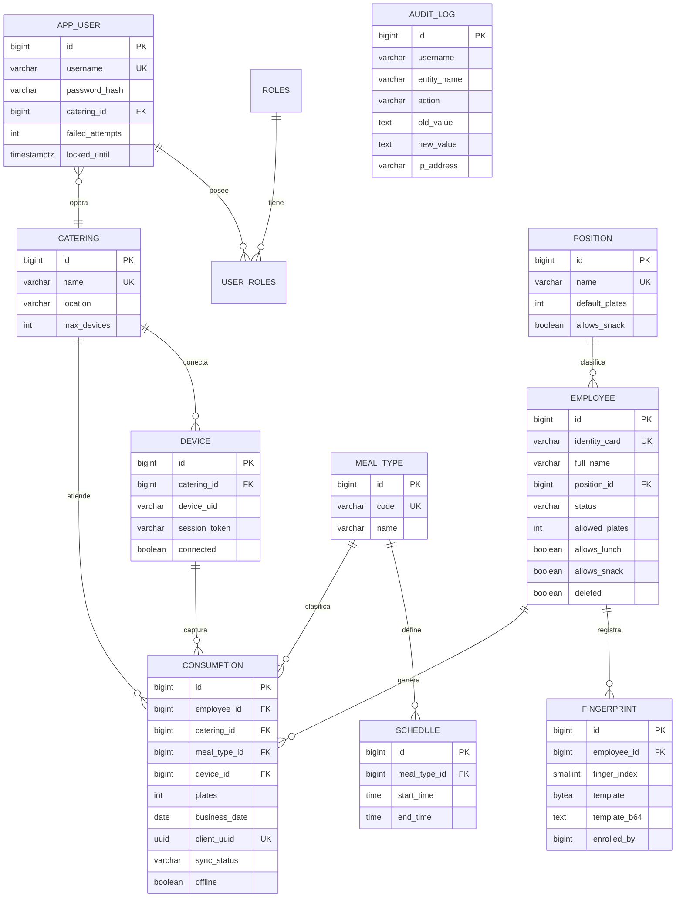
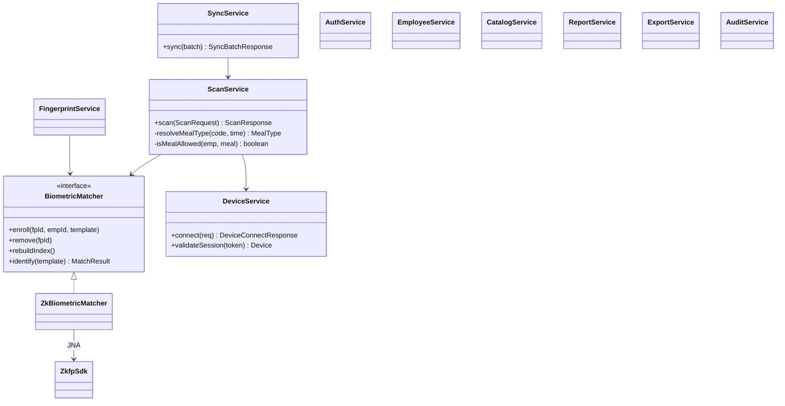

# Arquitectura — Control de Consumo de Alimentos (ZK9500)

## 1. Visión general

Sistema cliente-servidor de 3 capas con dispositivos de borde (catering):

- **Frontend PWA (React + Vite):** panel de administración/supervisión y pantalla de
  catering en modo kiosco; instalable y operable offline.
- **Backend (Spring Boot 3, Java 21):** API REST stateless con JWT, lógica de negocio,
  motor de identificación biométrica 1:N, auditoría, reportes y sincronización.
- **PostgreSQL:** persistencia transaccional.
- **Dispositivos de catering:** navegador en modo kiosco + agente local **ZKFinger WebAPI**
  conectado al lector **ZK9500** por USB.

```
Empleado → [Lector ZK9500] → ZKFinger WebAPI (WebSocket local)
                                   │ template (base64)
                                   ▼
                         Frontend PWA (kiosco)
                                   │ REST /api/scan  (+ cola offline)
                                   ▼
                    Backend Spring Boot ── 1:N (libzkfp/JNA) ── índice de plantillas
                                   │
                                   ▼
                              PostgreSQL
```

## 2. Modelo Entidad-Relación



**Restricciones e índices clave:**
- `UNIQUE(employee_id, meal_type_id, business_date)` → impide consumo duplicado por día.
- `UNIQUE(client_uuid)` → idempotencia de sincronización offline.
- Trigger `check_max_fingerprints` → máximo 3 huellas activas por empleado.
- Índice único parcial `schedule(meal_type_id) WHERE active` → un horario activo por comida.
- Empleado con `deleted=true` conserva su historial de `consumption`.

## 3. Diagrama de clases (capa de servicio)



## 4. Estrategia biométrica (ZK9500)

| Aspecto | Decisión |
|--------|----------|
| Captura | Agente **ZKFinger WebAPI** en el dispositivo, expuesto por WebSocket local. El navegador obtiene la **plantilla** (no la imagen). |
| Almacenamiento | Solo `template` (BYTEA) + copia base64. **Nunca** se guardan imágenes de huella. Máx. 3 por empleado. |
| Identificación | **1:N en el servidor** con `libzkfp` (`ZKFPM_DBIdentify`) vía **JNA**. Índice en memoria de todas las plantillas activas, reconstruible. |
| Umbral | Configurable (`app.biometric.match-threshold`, por defecto 70). |
| Intercambiable | Interfaz `BiometricMatcher`: `zk` (SDK real) o `sim` (pruebas sin hardware). |
| Resiliencia | Si el SDK nativo no carga, el servicio degrada a "HUELLA NO ENCONTRADA" sin caerse. |

## 5. Estrategia offline

1. El dispositivo opera normalmente sin conexión: captura la plantilla y la **encola en IndexedDB** con `clientUuid` + `consumedAt`.
2. Los registros en cola **no se pueden modificar**.
3. Al volver la conexión (evento `online` o sondeo cada 15 s), se envían en lote a `POST /api/scan/sync`.
4. El backend resuelve identidad y reglas en el momento de sincronizar y responde por registro.
5. **Antiduplicados:** `clientUuid` único + restricción `(empleado, comida, día)`. Reenviar un lote es seguro (idempotente).

> Compromiso de diseño: como la identificación 1:N ocurre en el servidor, en modo
> offline la pantalla confirma "REGISTRO EN COLA" (sin nombre) y la identidad se
> resuelve al sincronizar. Alternativa futura: delegar el `Identify` local al agente
> ZKFinger con las plantillas precargadas para mostrar el nombre también offline.

## 6. Seguridad

- **JWT** (access 30 min + refresh 7 días con rotación y revocación en `login_session`).
- **BCrypt** para contraseñas.
- **Roles** `ADMIN`/`SUPERVISOR`/`CATERING` con `@PreAuthorize` por endpoint.
- **Fuerza bruta:** bloqueo temporal tras N intentos (`app.security.brute-force`).
- **Dispositivos simultáneos:** máx. 2 por catering (token de sesión de dispositivo).
- **CORS** restringido por configuración; API stateless (sin cookies → superficie CSRF mínima).
- **Auditoría** de cambios con usuario, IP, user-agent, valor anterior/nuevo.

## 7. Despliegue

```
            ┌──────────── Nginx / reverse proxy (TLS) ────────────┐
            │  /            → frontend (PWA estática)              │
            │  /api, /swagger → backend Spring Boot (8080)         │
            └──────────────────────┬──────────────────────────────┘
                                   │
                    ┌──────────────┴──────────────┐
                    │  Spring Boot (JAR / Docker)  │
                    └──────────────┬──────────────┘
                                   │
                             PostgreSQL (con respaldos)
```

- **Backend:** `mvn clean package` → JAR ejecutable; o contenedor Docker (`eclipse-temurin:21-jre`). Montar `native/` con las DLL/.so del SDK.
- **Frontend:** `npm run build` → `dist/` servido por Nginx/CDN (PWA con service worker).
- **Dispositivos:** navegador en modo kiosco apuntando a `/kiosk`; agente ZKFinger instalado.
- **Variables sensibles** (JWT_SECRET, credenciales DB) por entorno/secrets, nunca en el repo.

## 8. Respaldo y recuperación

- **PostgreSQL:** `pg_dump` diario + WAL archiving para PITR (point-in-time recovery).
- **Retención:** 30 días en caliente, copias mensuales en almacenamiento externo.
- **Pruebas de restauración** periódicas en entorno de staging.
- **Plantillas biométricas:** incluidas en el respaldo de la BD (BYTEA); el índice en memoria se reconstruye al iniciar (`rebuildIndex`).
- **RPO** objetivo ≤ 24 h (≤ minutos con WAL); **RTO** ≤ 1 h.

## 9. Escalabilidad y mantenimiento

- Backend **stateless** → escalado horizontal tras balanceador. El índice biométrico es local a cada instancia; para muchos nodos, centralizar el matching en un servicio dedicado o usar identificación en el borde.
- **Connection pooling** (HikariCP) e índices en columnas de reporte (`business_date`, `catering_id`).
- Reportes pesados → vistas (`v_daily_consumption`) y posibilidad de réplica de lectura.
- **Migraciones versionadas** con Flyway. **Observabilidad** con Spring Actuator.
- Tipos de comida **extensibles** (tabla `meal_type`) sin cambios de esquema.
