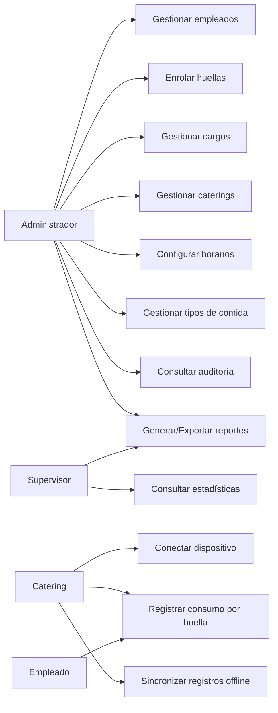

# Casos de uso e historias de usuario

## Actores

- **Administrador** — gestiona todo el sistema.
- **Supervisor** — solo consulta.
- **Catering (dispositivo/operador)** — registra consumos.
- **Empleado** — se identifica con su huella (no usa credenciales).

## Diagrama de casos de uso

## Casos de uso principales

### CU-11 Registrar consumo por huella
- **Actor:** Empleado / Catering
- **Precondición:** dispositivo conectado; empleado activo con huella enrolada.
- **Flujo principal:**
  1. El empleado coloca el dedo en el lector ZK9500.
  2. El agente captura la plantilla; el frontend la envía al backend.
  3. El backend identifica 1:N al empleado.
  4. Determina el tipo de comida según el horario vigente.
  5. Valida permisos y que no exista consumo duplicado del día.
  6. Registra el consumo y devuelve "REGISTRO EXITOSO" con nombre, comida, platos y hora.
- **Flujos alternos:**
  - *Huella no reconocida* → "HUELLA NO ENCONTRADA" + intento fallido.
  - *Fuera de horario* → "FUERA DEL HORARIO PERMITIDO", no registra.
  - *Ya consumió* → "ALMUERZO/MERIENDA YA REGISTRADO", no registra.
  - *Sin permiso* → "CONSUMO NO PERMITIDO".
  - *Sin conexión* → se encola localmente y se sincroniza luego.

### CU-10 Conectar dispositivo de catering
- Valida credenciales del catering y el límite de **2 dispositivos simultáneos**.
- Si se excede: "Se alcanzó el límite máximo de dispositivos permitidos."

### CU-02 Enrolar huellas
- Hasta **3 huellas** por empleado; se guarda solo la plantilla y el dedo, con fecha y usuario que enroló.

---

## Historias de usuario

### Administrador
- **HU-01** Como administrador quiero registrar empleados con cédula, cargo y permisos para controlar su acceso a comidas.
- **HU-02** Como administrador quiero enrolar hasta 3 huellas por empleado para asegurar la identificación.
- **HU-03** Como administrador quiero sobrescribir los platos/merienda de un empleado por encima de su cargo para casos especiales.
- **HU-04** Como administrador quiero configurar horarios de almuerzo y merienda para controlar cuándo se permite el consumo.
- **HU-05** Como administrador quiero crear caterings y limitar sus dispositivos para controlar los puntos de entrega.
- **HU-06** Como administrador quiero consultar la auditoría de cambios para tener trazabilidad.
- **HU-07** Como administrador quiero inactivar empleados sin perder su historial de consumos.

### Supervisor
- **HU-08** Como supervisor quiero ver el dashboard del día (consumos, platos, pendientes, %) para monitorear la operación.
- **HU-09** Como supervisor quiero exportar reportes a PDF/Excel/CSV para análisis externo.
- **HU-10** Como supervisor quiero ver tendencias de consumo para anticipar la demanda.

### Catering
- **HU-11** Como operador de catering quiero que el empleado solo ponga el dedo para registrar su consumo rápidamente.
- **HU-12** Como operador quiero retroalimentación visual y sonora (éxito/error) para operar sin leer textos largos.
- **HU-13** Como operador quiero seguir registrando aunque se caiga la red, con sincronización automática al volver.

## Criterios de aceptación (ejemplos)
- Un empleado no puede registrar el mismo tipo de comida dos veces el mismo día.
- Fuera del horario configurado no se registra ningún consumo.
- El tercer dispositivo de un catering no puede conectarse mientras haya 2 activos.
- Al reconectarse, los registros offline se aplican sin generar duplicados.
- La pantalla de éxito se muestra ~10 s y luego vuelve a "Esperando huella...".
